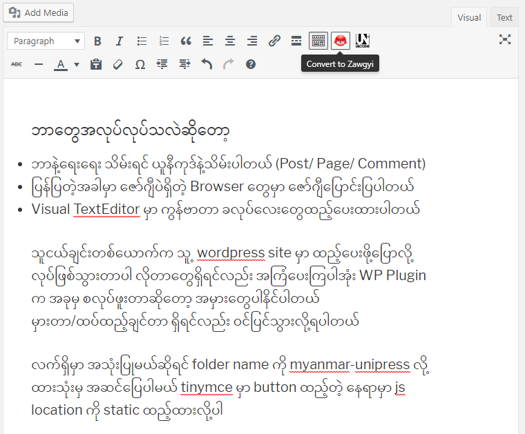

Myanmar UniPress
==============

### Tags: myanmar font, Myanmar3, Unicode, Zawgyi, Converter

Requires at least: 3.0.1

Tested up to: 5.2.1

Stable tag: 1.1.1

License: GNU GENERAL PUBLIC LICENSE

Myanmar UniPress will check myanmar content and convert to unicode before saving.

## Description

Myanmar UniPress will check myanmar content and convert to browser encoding if the content font is not equal to brower font and Myanmar UniPress will conver the zawgyi contents (posts, comments, pages) as unicode before save. 

## Installation

This section describes how to install the plugin and get it working.

e.g.

1. Rename trunk folder as `myanmar-unipress` and upload this folder to the `/wp-content/plugins/` directory, or install the plugin through the WordPress plugins screen directly.
2. Activate the plugin through the 'Plugins' screen in WordPress
3. Use the Settings->Myanmar UniPress screen to configure the MyanmarUnipress

## Frequently Asked Questions 

Nothing at the moment

## Screenshots 

1. Preview of ClassicText Editor with MyanmarUnipress

## Changelog 

### 1.1.1
* Update rabbit.js for better converting.

### 1.1.0
* Detecting browser font and auto converting to display
* Detecting content type is Unicode or Zawgyi
* Save all update/insert contents as Unicode
* Converter buttons in text editor (Need to used classic editor).

## Upgrade Notice 

Nothing at the moment

## Todo 

1. Add converter buttons on default block of new wp editor 

## Contribution 
You can contribute this plugin on this  [repository (Myanmar-Unipress)](https://github.com/thixpin/Myanmar-UniPress)

Contributions are warmly welcome. It is only the collection source code of othere developer (I am only copy paste developer :trollface:) . If you have better idea, please do contribution. 

## Support 

You can connect [me](http://fb.me/thixpin) to get support.

## Credits 

- [Rabbit Converter](https://github.com/Rabbit-Converter/) was used for Unicode<==>Zawgyi converting.

- Myanmar font detecting and converting functions are come from [MUA-Web-Unicode-Converter](https://github.com/thixpin/MUA-Web-Unicode-Converter) 

- Browser font detecting idea from `Ko Ei maung`

- Plugin template is based on [Zawgyi Embed](https://wordpress.org/plugins/zawgyi-embed/)

