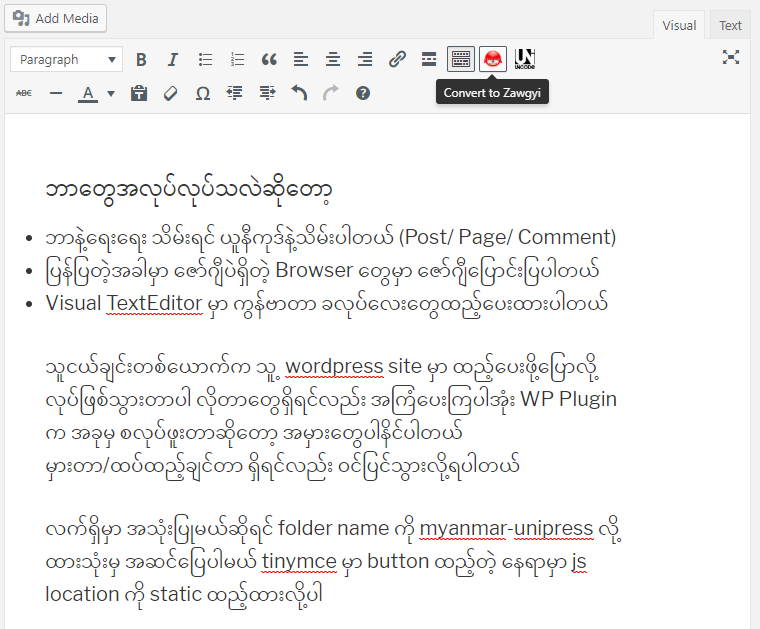

Myanmar UniPress
==============

## Tags: myanmar font, Myanmar3, Unicode, Zawgyi, Converter

Requires at least: 2.5

Tested up to: 4.9.6

Stable tag: 1.0.0

License: GNU GENERAL PUBLIC LICENSE

Myanmar UniPress will check myanmar content and convert to browser encoding if the content font is not equal to brower font and Myanmar UniPress will conver the zawgyi contents (posts, comments, pages) as unicode before save. 

## Description 

Myanmar UniPress will check myanmar content and convert to browser encoding if the content font is not equal to brower font and Myanmar UniPress will conver the zawgyi contents (posts, comments, pages) as unicode before save. 

## Installation 

This section describes how to install the plugin and get it working.

e.g.

1. Upload `myanmar-unipress` folder to the `/wp-content/plugins/` directory
2. Activate the plugin through the 'Plugins' menu in WordPress
3. WP Admin -> Settings -> Myanmar UniPress

## Credits
- [Rabbit Converter](https://github.com/Rabbit-Converter/) was used for Unicode<==>Zawgyi converting.

- Myanmar font detecting and converting functions are come from [MUA-Web-Unicode-Converter](https://github.com/thixpin/MUA-Web-Unicode-Converter) 

- Browser font detecting idea from `Ko Ei maung`

- Plugin template is based on [Zawgyi Embed](https://wordpress.org/plugins/zawgyi-embed/)

#
## Changelog 

#### Version  1.0.0 
- Detecting browser font and auto converting to display
- Detecting content type is Unicode or Zawgyi
- Save all update/insert contents as Unicode
- Converter buttons in text editor.

#

## Todo
- Please suggest me

## Contribution
Contributions are warmly welcome. It is only the collection source code of othere developer (I am only copy paste developer :trollface: . If you have better idea, please do contribution. 

#
Support
---
You can connect [me](http:fb.me/thixpin) to get support.
#